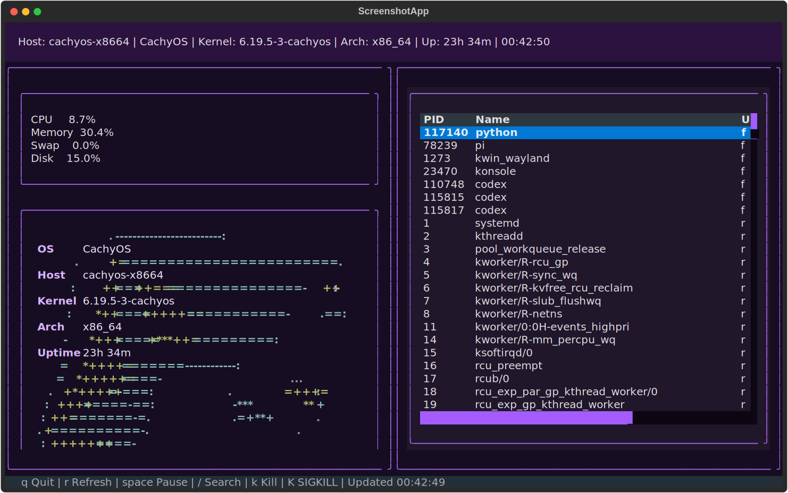

# TermScope

TermScope is a Linux/server monitoring TUI built with **Textual** and **psutil**.
It combines a live resource dashboard, a neofetch-style distro panel, and an interactive process explorer with keyboard-driven search, sorting, and process actions.

<p align="center">
  
</p>

## Highlights

- Live Linux system dashboard
- Distro detection from `/etc/os-release`
- Neofetch-style ASCII distro art sourced from neofetch definitions
- Per-distro theme colors
- CPU / memory / swap / disk / load / network monitoring
- Full process table with keyboard navigation
- Incremental process search like Windows Task Manager
- Explicit `/` search mode
- Repeated first-letter cycling through matching processes
- Prefix highlight inside matching process names
- Tracked selection across refreshes and resorting
- CPU / memory ascending/descending toggle
- Kill workflow with confirmation dialog
- Stronger warning for root / critical system processes

---

## Screens

### Dashboard
Shows:
- host summary
- Linux distro / kernel / architecture / uptime
- CPU / memory / swap / disk / load / network stats
- neofetch-style distro panel
- process table

### Processes
Shows:
- full process list
- CPU / memory sorting
- incremental search
- explicit search mode
- tracked process selection

---

## Requirements

- Linux
- Python **3.11+**
- A terminal with decent Unicode support
- Nerd Font recommended for the best distro/logo appearance

---

## Installation

### bash / zsh

```bash
python -m venv .venv
source .venv/bin/activate
python -m pip install -e .[dev]
```

### fish

```fish
python -m venv .venv
source .venv/bin/activate.fish
python -m pip install -e .[dev]
```

---

## Run

```bash
termscope
```

Or without activating the environment:

```bash
.venv/bin/termscope
```

---

## Controls

### Global
- `q` — quit
- `r` — refresh now
- `space` — pause / resume live refresh
- `k` — confirm and send `SIGTERM` to selected process
- `K` — confirm and send `SIGKILL` to selected process

### Processes screen
- `c` — toggle CPU sort between descending and ascending
- `m` — toggle memory sort between descending and ascending
- type letters / numbers — incremental jump by process-name prefix
- repeat the same first letter — cycle through matching processes
- `/` — enter explicit search mode
- `Enter` — accept and exit explicit search mode
- `Backspace` — delete one search character
- `Esc` — clear current search and exit search mode

---

## Search behavior

TermScope supports two search styles:

### 1. Incremental search
Just start typing in the **Processes** screen.

Examples:
- `p` → jump to first process starting with `p`
- `py` → jump to something like `python`
- repeatedly press `p` → cycle through `p...` matches

### 2. Explicit `/` search mode
Press `/`, then type a query.

While in search mode:
- the title shows `[SEARCH MODE]`
- the footer shows the active `/query`
- matching process-name prefixes are highlighted
- if nothing matches, TermScope shows a clear **no match** message

---

## Sorting behavior

In the **Processes** screen:

- first press on `c` switches to **CPU descending**
- pressing `c` again toggles to **CPU ascending**
- first press on `m` switches to **Memory descending**
- pressing `m` again toggles to **Memory ascending**

The current direction is shown with arrows:
- `cpu ↓`
- `cpu ↑`
- `memory ↓`
- `memory ↑`

---

## Kill safety

When killing a process:

- `k` opens a confirmation dialog for `SIGTERM`
- `K` opens a confirmation dialog for `SIGKILL`

Critical targets receive a stronger warning, including cases like:
- `root`-owned processes
- PID 1
- low PID system processes
- common system daemons
- kernel-thread-like names

---

## Distro / theme support

The distro panel uses neofetch-style ASCII definitions and per-distro colors.
Current themes / logo support include:

- Arch
- CachyOS
- Ubuntu
- Debian
- Fedora
- NixOS
- Alpine
- Gentoo
- fallback default theme

---

## Development

### Run tests

```bash
pytest -q
```

### Type of project layout

```text
termscope/
├── app.py
├── collectors/
├── screens/
├── styles/
├── utils/
└── widgets/
```

### Important modules

- `termscope/app.py` — app entrypoint and refresh loop
- `termscope/collectors/` — system / metrics / process collection
- `termscope/screens/dashboard.py` — dashboard screen
- `termscope/screens/processes.py` — process screen interactions
- `termscope/widgets/process_table.py` — process table behavior
- `termscope/widgets/distro_panel.py` — neofetch-style distro widget
- `termscope/styles/app.tcss` — styling and theme rules

---

## Troubleshooting

### fish cannot source `.venv/bin/activate`
Use the fish-specific activate script:

```fish
source .venv/bin/activate.fish
```

### GitHub push over HTTPS asks for username/password
Use SSH instead.
If your remote is not already SSH:

```bash
git remote set-url origin git@github.com:cframe230/Termscope-.git
```

Then test:

```bash
ssh -T git@github.com
```

And push:

```bash
git push -u origin main
```

### The distro art looks odd
Use a terminal/font with better Unicode coverage.
A Nerd Font is recommended.

### Process kill says permission denied
That process likely belongs to another user or requires elevated privileges.

---

## Packaging

`pyproject.toml` exposes the app as a console script:

```toml
[project.scripts]
termscope = "termscope.app:main"
```

So after install, you can launch it with:

```bash
termscope
```

---

## License

No project license has been added yet.
